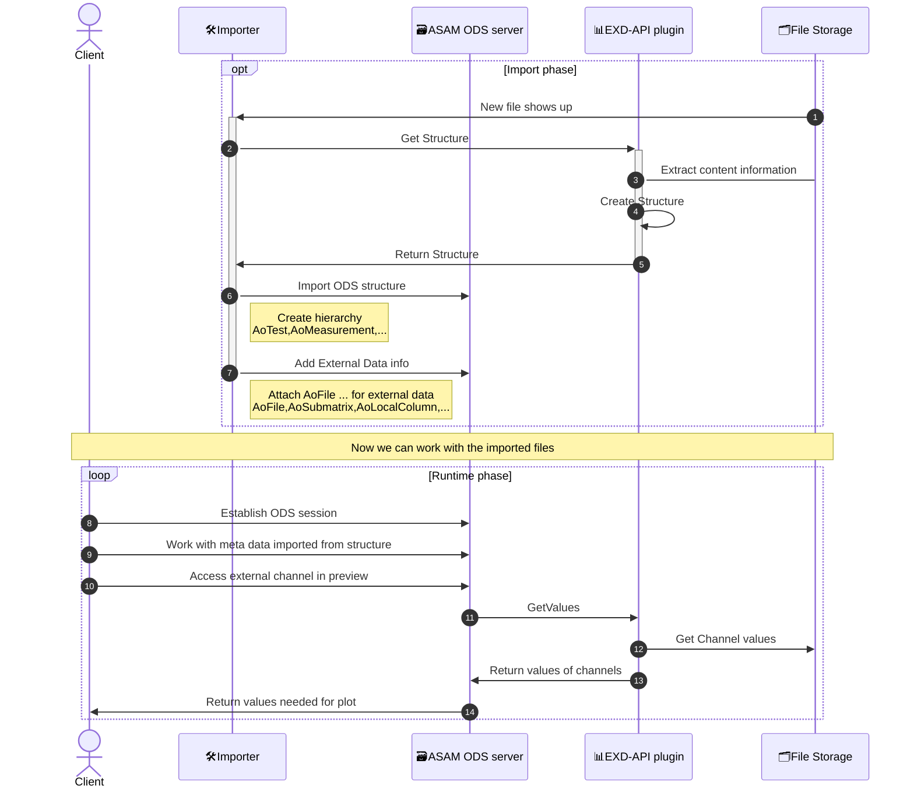

# ods-exd-api-box

[](https://www.python.org/downloads/)
[](https://opensource.org/licenses/MIT)
[](https://github.com/astral-sh/ruff)
[](http://mypy-lang.org/)

A Python helper package to build **ASAM ODS EXD-API** gRPC plugins/services.

> **📖 Full documentation:** [totonga.github.io/ods-exd-api-box](https://totonga.github.io/ods-exd-api-box/)

## What is ASAM ODS EXD-API?

The [ASAM ODS](https://www.asam.net/standards/detail/ods/) standard defines how measurement and test data is stored and managed. The **EXD-API** (External Data API) is a gRPC interface that allows ODS servers to read data from external file formats (TDMS, CSV, HDF5, …) without importing the raw data.

## Installation

```bash
# Core (ExdFileInterface only)
pip install ods-exd-api-box

# With pandas support (FileSimpleInterface)
pip install 'ods-exd-api-box[simple]'
```

## Quick Start

### Full-control interface

```python
from ods_exd_api_box import ExdFileInterface, serve_plugin

class MyFileHandler(ExdFileInterface):
    # Implement: create, close, fill_structure, get_values
    ...

if __name__ == "__main__":
    serve_plugin("my-format", MyFileHandler.create, ["*.myext"])
```

### Pandas-based simple interface

```python
from ods_exd_api_box.simple import FileSimpleInterface, serve_plugin_simple

class MySimpleHandler(FileSimpleInterface):
    # Implement: create, close, data (returns pd.DataFrame)
    ...

if __name__ == "__main__":
    serve_plugin_simple("my-format", MySimpleHandler.create, ["*.myext"])
```

## Architecture


```mermaid
sequenceDiagram
    actor CLIENT as Client
    participant PDTT as 🛠️Importer
    participant PODS as 🗃️ASAM ODS server
    participant PLUGIN as 📊EXD-API plugin
    participant FILE as 🗂️File Storage

    autonumber

    opt Import phase
        FILE ->>+ PDTT: New file shows up
        PDTT ->>+ PLUGIN : Get Structure
        PLUGIN -> FILE: Extract content information
        PLUGIN ->> PLUGIN: Create Structure
        PLUGIN ->>- PDTT: Return Structure
        PDTT ->> PODS: Import ODS structure
        Note right of PDTT: Create hierarchy<br/>AoTest,AoMeasurement,...
        PDTT ->>- PODS: Add External Data info
        Note right of PDTT: Attach AoFile ... for external data<br/>AoFile,AoSubmatrix,AoLocalColumn,...
    end

    Note over CLIENT, FILE: Now we can work with the imported files

    loop Runtime phase
        CLIENT ->> PODS: Establish ODS session
        CLIENT ->> PODS: Work with meta data imported from structure
        CLIENT ->> PODS: Access external channel in preview
        PODS ->> PLUGIN: GetValues
        PLUGIN ->> FILE: Get Channel values
        PLUGIN ->> PODS: Return values of channels
        PODS ->> CLIENT: Return values needed for plot
    end
```

## Documentation

| Topic | Link |
|---|---|
| Architecture & internals | [Architecture](https://totonga.github.io/ods-exd-api-box/architecture) |
| Choosing an interface | [Comparison](https://totonga.github.io/ods-exd-api-box/interfaces) |
| ExdFileInterface guide | [Full-control interface](https://totonga.github.io/ods-exd-api-box/exd-file-interface) |
| FileSimpleInterface guide | [Simple interface](https://totonga.github.io/ods-exd-api-box/file-simple-interface) |
| Server options & TLS | [Server Options](https://totonga.github.io/ods-exd-api-box/server-options) |
| Docker deployment | [Docker](https://totonga.github.io/ods-exd-api-box/docker) |
| Real-world plugins | [Plugins](https://totonga.github.io/ods-exd-api-box/plugins) |

## Development

```bash
pip install -e ".[dev,simple]"
python -m unittest discover -s tests
mypy .
```

## Contributing

0. Use dev container or set up local dev environment
1. Ensure type checking passes: `mypy .`
2. Run tests: `python -m unittest discover -s tests`
3. Follow code style (Ruff, mypy)
4. Add tests for new features

## License

MIT License - see [LICENSE](LICENSE) file for details.

## References

- [ASAM ODS Standard](https://www.asam.net/standards/detail/ods/)
- [ASAM ODS GitHub Repository](https://github.com/asam-ev/ASAM-ODS-Interfaces)
- [gRPC Documentation](https://grpc.io/docs/)
- [Peak-Solution Data Management Learning Path](https://peak-solution.github.io/data_management_learning_path/exd_api/overview.html)
