# ASAM ODS EXD-API for NI TDMS Files

[](https://www.python.org/downloads/)
[](https://opensource.org/licenses/MIT)
[](https://github.com/psf/black)
[](http://mypy-lang.org/)

## ASAM ODS EXD-API Architecture

```mermaid
sequenceDiagram

actor CLIENT as Client
participant PDTT as 🛠️Importer
participant PODS as 🗃️ASAM ODS server
participant PLUGIN as 📊EXD-API plugin
participant FILE as 🗂️File Storage

autonumber

opt Import phase
  FILE ->>+ PDTT: New file shows up
  PDTT ->>+ PLUGIN : Get Structure
  PLUGIN -> FILE: Extract content information
  PLUGIN ->> PLUGIN: Create Structure
  PLUGIN ->>- PDTT: Return Structure
  PDTT ->> PODS: Import ODS structure
  Note right of PDTT: Create hierarchy<br/>AoTest,AoMeasurement,...
  PDTT ->>- PODS: Add External Data info
  Note right of PDTT: Attach AoFile ... for external data<br/>AoFile,AoSubmatrix,AoLocalColumn,...
end

Note over CLIENT, FILE: Now we can work with the imported files

loop Runtime phase
  CLIENT ->> PODS: Establish ODS session
  CLIENT ->> PODS: Work with meta data imported from structure
  CLIENT ->> PODS: Access external channel in preview
  PODS ->> PLUGIN: GetValues
  PLUGIN ->> FILE: Get Channel values
  PLUGIN ->> PODS: Return values of channels
  PODS ->> CLIENT: Return values needed for plot
end
```



## Configuration & Usage

### Server Options

```bash
python external_data_file.py --help
```

Key configuration options:

| Option | Env Variable | Default | Description |
|--------|--------------|---------|-------------|
| `--port` | `ODS_EXD_API_PORT` | `50051` | Port to run gRPC server on |
| `--verbose` | `ODS_EXD_API_VERBOSE` | `False` | Enable debug logging |
| `--bind-address` | `ODS_EXD_API_BIND_ADDRESS` | `[::]` | Address to bind gRPC server to |
| `--max-workers` | `ODS_EXD_API_MAX_WORKERS` | `2 × CPU count` | Maximum number of worker threads |
| `--max-concurrent-streams` | `ODS_EXD_API_MAX_CONCURRENT_STREAMS` | `None` | Maximum concurrent gRPC streams |
| `--max-send-message-length` | `ODS_EXD_API_MAX_SEND_MESSAGE_LENGTH` | `512` | Max send message length (MB) |
| `--max-receive-message-length` | `ODS_EXD_API_MAX_RECEIVE_MESSAGE_LENGTH` | `32` | Max receive message length (MB) |
| `--use-tls` | `ODS_EXD_API_USE_TLS` | `False` | Enable TLS/SSL |
| `--tls-cert-file` | `ODS_EXD_API_TLS_CERT_FILE` | `None` | Path to server certificate (PEM) |
| `--tls-key-file` | `ODS_EXD_API_TLS_KEY_FILE` | `None` | Path to server private key (PEM) |
| `--tls-client-ca-file` | `ODS_EXD_API_TLS_CLIENT_CA_FILE` | `None` | CA bundle for client verification |
| `--require-client-cert` | `ODS_EXD_API_REQUIRE_CLIENT_CERT` | `False` | Require valid client certificate |
| `--health-check-enabled` | `ODS_EXD_API_HEALTH_CHECK_ENABLED` | `False` | Enable health check service |
| `--health-check-bind-address` | `ODS_EXD_API_HEALTH_CHECK_BIND_ADDRESS` | `[::]` | Health check service bind address |
| `--health-check-port` | `ODS_EXD_API_HEALTH_CHECK_PORT` | `50052` | Health check service port |
| `--env-prefix` | - | `ODS_EXD_API_` | Environment variable prefix for multi-instance deployments |

#### Configuration Priority

Values are resolved in this order (highest to lowest priority):
1. Command line arguments
2. Environment variables
3. Default values

### TLS Configuration

**Basic TLS:**

```bash
python external_data_file.py \
  --use-tls \
  --tls-cert-file /path/to/server.crt \
  --tls-key-file /path/to/server.key
```

**Mutual TLS (mTLS):**

```bash
python external_data_file.py \
  --use-tls \
  --tls-cert-file /path/to/server.crt \
  --tls-key-file /path/to/server.key \
  --tls-client-ca-file /path/to/client-ca.crt \
  --require-client-cert
```

**Docker with TLS:**

```bash
docker run \
  -v /path/to/certs:/certs \
  -p 50051:50051 \
  ghcr.io/totonga/asam-ods-exd-api-nptdms:latest \
  --use-tls \
  --tls-cert-file /certs/server.crt \
  --tls-key-file /certs/server.key
```

## Development

### Setup Development Environment

```bash
# Install with development dependencies
pip install -e ".[dev]"
```

### Type Checking

```bash
mypy .
```

### Running Tests

```bash
python -m unittest discover -s tests
```

### Running Docker Integration Tests

```bash
python -m unittest tests.test_docker_integration -v
```

### Code Style

The project uses:
- **Black** for code formatting
- **isort** for import sorting
- **Pylint** for linting
- **Mypy** for static type checking

### Updating Protocol Buffers

The protobuf files are generated from the ASAM ODS standard specifications:

```bash
# Download latest proto files
curl -o ods.proto https://raw.githubusercontent.com/asam-ev/ASAM-ODS-Interfaces/main/ods.proto
curl -o ods_external_data.proto https://raw.githubusercontent.com/asam-ev/ASAM-ODS-Interfaces/main/ods_external_data.proto

# Generate Python stubs
mkdir -p ods_exd_api_box/proto
python3 -m grpc_tools.protoc \
  -I. \
  --python_out=ods_exd_api_box/proto/. \
  --pyi_out=ods_exd_api_box/proto/. \
  --grpc_python_out=ods_exd_api_box/proto/. \
  ods.proto ods_external_data.proto
```

## Performance Considerations

- **File Caching** - Opened files are cached to minimize I/O operations
- **Reference Counting** - Automatic resource cleanup with reference counting
- **Thread Pool** - Configurable worker threads for parallel request handling
- **Message Size Limits** - Configurable max send/receive message sizes

## Troubleshooting

### Connection Refused

Ensure the server is running and listening on the correct port:

```bash
netstat -tlnp | grep 50051
```

### TLS Certificate Errors

Verify certificate paths and permissions:

```bash
openssl x509 -in /path/to/cert.crt -text -noout
```

### Type Checking Failures

Ensure all dependencies are installed with type stubs:

```bash
pip install -e ".[dev]"
mypy .
```

## Contributing

Contributions are welcome! Please:

0. Use dev container or set up local dev environment
1. Ensure type checking passes: `mypy .
2. Run tests: `python -m unittest discover -s tests`
3. Follow code style (Black, isort)
4. Add tests for new features

## License

MIT License - see [LICENSE](LICENSE) file for details.

## References

- [ASAM ODS Standard](https://www.asam.net/standards/detail/ods/)
- [ASAM ODS GitHub Repository](https://github.com/asam-ev/ASAM-ODS-Interfaces)
- [gRPC Documentation](https://grpc.io/docs/)
- [Peak-Solution Data Management Learning Path](https://peak-solution.github.io/data_management_learning_path/exd_api/overview.html)
