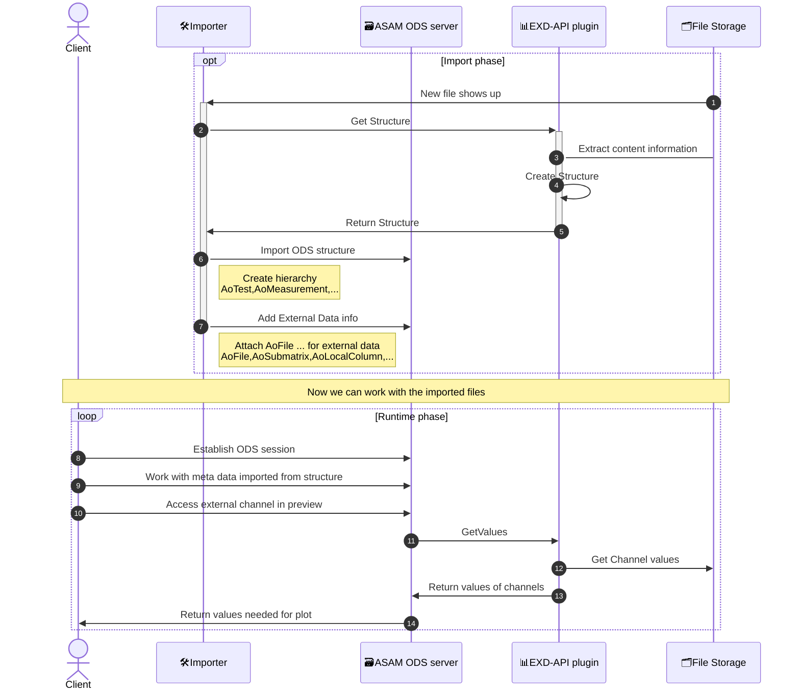

# ods-exd-api-box

[](https://www.python.org/downloads/)
[](https://opensource.org/licenses/MIT)

A Python helper package to build **ASAM ODS EXD-API** gRPC plugins/services.

## What is ASAM ODS EXD-API?

The [ASAM ODS](https://www.asam.net/standards/detail/ods/) standard defines how measurement and test data is stored and managed. The **EXD-API** (External Data API) is a gRPC interface that allows ODS servers to read data from external file formats (TDMS, CSV, HDF5, …) without importing the raw data.

An EXD-API plugin acts as a bridge: the ODS server calls the plugin to inspect a file's structure (groups, channels, data types) and to retrieve channel values on demand.

## How this library helps

`ods-exd-api-box` provides the gRPC server scaffolding, protobuf wiring, file registry, and configuration handling so you can focus on the file-reading logic. It offers **two interfaces** at different abstraction levels:

| Interface | Best for | Protobuf knowledge required? |
|---|---|---|
| [`ExdFileInterface`](exd-file-interface) | Full control over structure and value mapping | Yes |
| [`FileSimpleInterface`](file-simple-interface) | Quick plugins using pandas DataFrames | No |

See [Choosing an Interface](interfaces) for a detailed comparison.

## Installation

```bash
# Core (ExdFileInterface only)
pip install ods-exd-api-box

# With pandas support (FileSimpleInterface)
pip install 'ods-exd-api-box[simple]'
```

## Architecture Overview



## Quick Start

### Using `ExdFileInterface` (full control)

```python
from ods_exd_api_box import ExdFileInterface, serve_plugin

class MyFileHandler(ExdFileInterface):
    # Implement create, close, fill_structure, get_values
    ...

if __name__ == "__main__":
    serve_plugin(
        file_type_name="my-format",
        file_type_factory=MyFileHandler.create,
        file_type_file_patterns=["*.myext"],
    )
```

### Using `FileSimpleInterface` (pandas-based)

```python
from ods_exd_api_box.simple import FileSimpleInterface, serve_plugin_simple

class MySimpleHandler(FileSimpleInterface):
    # Implement create, close, data (returns pd.DataFrame)
    ...

if __name__ == "__main__":
    serve_plugin_simple(
        file_type_name="my-format",
        file_type_factory=MySimpleHandler.create,
        file_type_file_patterns=["*.myext"],
    )
```

## Documentation

| Page | Description |
|---|---|
| [Architecture](architecture) | Internal wiring, call flow, how the two interfaces relate |
| [Choosing an Interface](interfaces) | Side-by-side comparison of both approaches |
| [ExdFileInterface Guide](exd-file-interface) | Full-control interface with protobuf |
| [FileSimpleInterface Guide](file-simple-interface) | Pandas-based simple interface |
| [Server Options](server-options) | CLI arguments, env vars, TLS configuration |
| [Docker Deployment](docker) | Containerizing your plugin |
| [Real-World Plugins](plugins) | Production plugins using this library |

## References

- [ASAM ODS Standard](https://www.asam.net/standards/detail/ods/)
- [ASAM ODS GitHub Repository](https://github.com/asam-ev/ASAM-ODS-Interfaces)
- [gRPC Documentation](https://grpc.io/docs/)
- [Peak-Solution Data Management Learning Path](https://peak-solution.github.io/data_management_learning_path/exd_api/overview.html)
